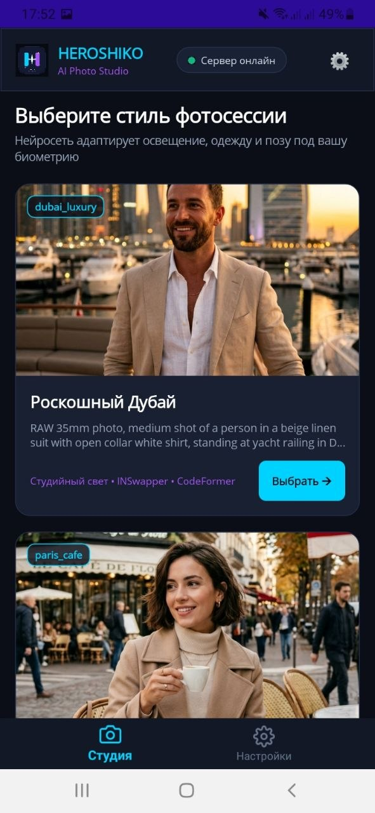
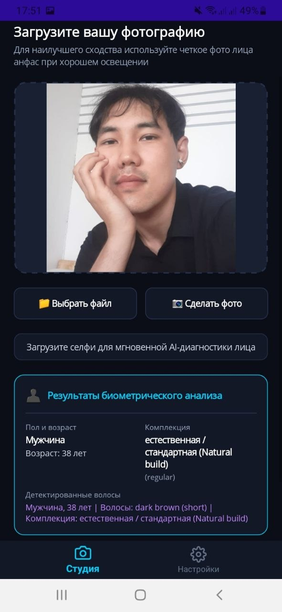
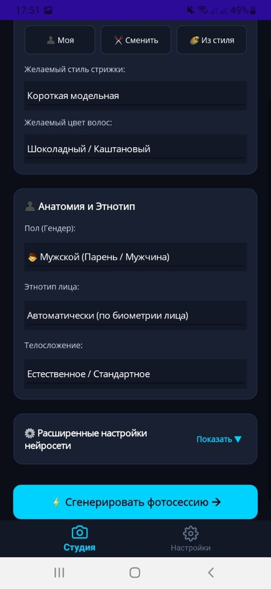
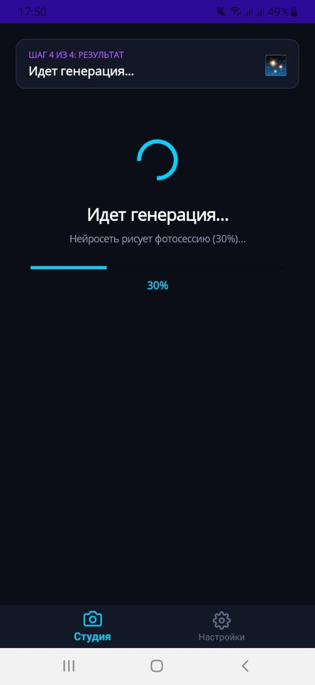
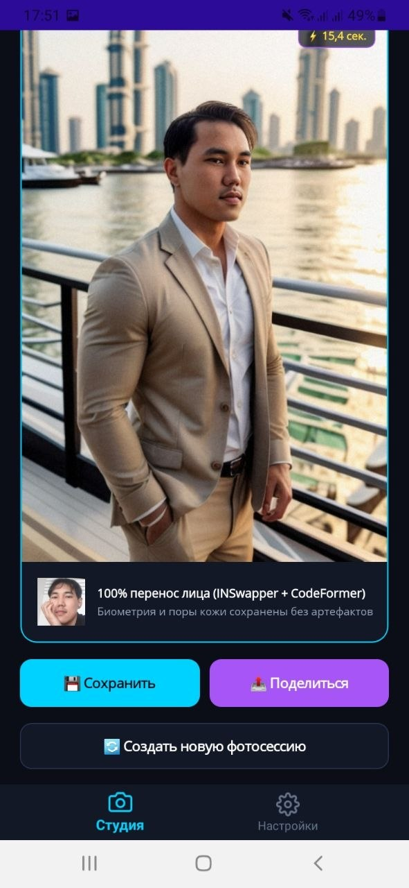
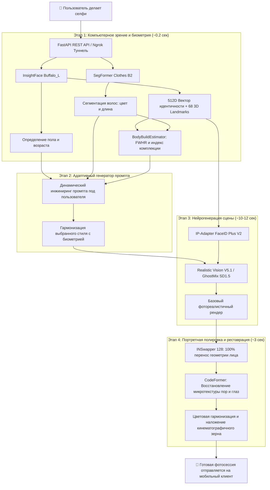

<div align="center">

# ✦ HEROSHIKO AI PHOTO STUDIO ✦

### *Персональная мобильная фотостудия нового поколения на базе генеративного искусственного интеллекта*

[](https://dotnet.microsoft.com/en-us/apps/maui)
[](https://www.python.org/)
[](https://fastapi.tiangolo.com/)
[](https://pytorch.org/)
[](https://github.com/deepinsight/insightface)
[](https://github.com/huggingface/diffusers)
[](#)

<br/>

> **Heroshiko** превращает обычное селфи со смартфона в профессиональную студийную фотосессию журнального качества всего за **~15 секунд**. Нейросетевой конвейер анализирует черты лица, прическу и комплекцию пользователя, адаптирует освещение, одежду и позу выбранного пресета, сохраняя 100% портретное сходство и естественную микротекстуру кожи без эффекта размытия или «пластикового» лица.

---

</div>

## 📱 Скриншоты и пользовательский сценарий

Ниже продемонстрирован полный путь создания персональной фотосессии в мобильном приложении Heroshiko:

<table>
  <tr>
    <td width="33%" align="center"><b>1. Выбор стиля фотосессии</b></td>
    <td width="33%" align="center"><b>2. Загрузка селфи и AI-диагностика</b></td>
    <td width="33%" align="center"><b>3. Персонализация параметров</b></td>
  </tr>
  <tr>
    <td align="center">
      
    </td>
    <td align="center">
      
    </td>
    <td align="center">
      
    </td>
  </tr>
  <tr>
    <td align="top">
      Выбор одной из кинематографичных сцен: <i>«Роскошный Дубай»</i>, <i>«Парижское кафе»</i>, <i>«K-Pop Айдол»</i> и др. Отображение статуса сервера в реальном времени.
    </td>
    <td align="top">
      Пользователь делает снимок или выбирает фото из галереи. Бэкенд за долю секунды определяет пол, возраст, цвет/длину волос и комплекцию тела.
    </td>
    <td align="top">
      Гибкое управление деталями: сохранить свою прическу, изменить стрижку/цвет, скорректировать анатомию, этнотип и телосложение перед генерацией.
    </td>
  </tr>
</table>

<br/>

<table>
  <tr>
    <td width="50%" align="center"><b>4. Процесс генерации (Live Progress)</b></td>
    <td width="50%" align="center"><b>5. Готовый результат с 100% сходством</b></td>
  </tr>
  <tr>
    <td align="center">
      
    </td>
    <td align="center">
      
    </td>
  </tr>
  <tr>
    <td align="top">
      Отслеживание этапов генерации нейросетью в реальном времени (анализ позы, диффузия, перенос идентичности, реставрация деталей).
    </td>
    <td align="top">
      Финальный фотореалистичный кадр (~15.4 сек). Безупречное сохранение пор кожи и биометрии лица. Кнопки мгновенного сохранения в галерею и шаринга.
    </td>
  </tr>
</table>

---

## ⚙️ Как работает программа (Архитектура пайплайна)

Heroshiko состоит из двух ключевых компонентов:
1. **Клиентское приложение (`heroshika-client`)** — кроссплатформенное приложение на **.NET 10 MAUI** (Android / Windows / iOS) со стильным неоновым Dark Studio дизайном, плавными анимациями и пошаговым визардом.
2. **AI-сервер (`heroshiko-backend`)** — высокопроизводительный асинхронный сервер на **FastAPI**, интегрированный с передовыми моделями Computer Vision и диффузии.

### Схема обработки данных



### Подробное описание ключевых этапов:

1. **Компьютерное зрение и биометрический анализ (`FaceIdentityExtractor` + `HairAnalyzer` + `BodyBuildEstimator`)**:
   - При загрузке фото модель **InsightFace (RetinaFace + ArcFace)** выделяет ключевые ориентиры лица (68 landmarks) и формирует 512-мерный вектор идентичности.
   - Нейросеть **SegFormer** сегментирует область прически, автоматически вычисляет цветовые компоненты и определяет исходную длину волос.
   - **BodyBuildEstimator** по пропорциям лица (**FWHR** — *Facial Width-to-Height Ratio* и расстоянию между скулами) оценивает комплекцию тела (*slender*, *regular*, *athletic*, *plus_size*).
2. **Динамическая адаптация промпта**:
   - На основе пресета (например, яхта в Дубае) и полученных биометрических характеристик формируется адаптированный промпт: задается правильный покрой костюма под комплекцию, учитываются пожелания по прическе (сохранить свою стрижку, выбрать модельную или взять из стиля пресета).
3. **Генерация окружения и композиции (`HeroshikoSD15Engine`)**:
   - Используется легковесный и невероятно реалистичный чекпоинт **Realistic Vision V5.1 / GhostMix**.
   - С помощью **IP-Adapter FaceID** эмбеддинг лица направляет латентную диффузию, задавая анатомически верное позиционирование головы, взгляд и освещение окружения.
4. **Безупречный перенос и реставрация лица (`PostProcessor`)**:
   - **INSwapper**: производит точечный своп лица с сохранением оригинальных черт, формы носа, губ и взгляда.
   - **CodeFormer**: восстанавливает мельчайшие микродетали — поры кожи, ресницы, радужку глаз и волоски, исключая эффект замыленности и артефакты.
   - **Цветокоррекция**: тон лица идеально сводится с окружающим студийным светом сцены (закатный свет в Дубае, мягкий рассеянный свет парижского утра и т.д.).

---

## 📂 Структура проекта

```text
heroshiko/
├── Screens/                          # Скриншоты работы мобильного приложения
│   ├── photo_2026-09-13_18-00-33.jpg # Шаг 1: Выбор стиля
│   ├── photo_2026-09-13_18-00-43.jpg # Шаг 2: Загрузка селфи и биометрия
│   ├── photo_2026-09-13_18-00-36.jpg # Шаг 3: Настройка параметров
│   ├── photo_2026-09-13_18-00-45.jpg # Шаг 4: Индикатор генерации
│   ├── photo_2026-09-13_18-00-41.jpg # Финальный результат
│   └── splash.png                    # Сплэш-экран приложения
│
├── heroshika-client/                 # Мобильный клиент (.NET 10 MAUI)
│   ├── Models/                       # DTO модели (Preset, TaskStatus, FaceProfile)
│   ├── Services/                     # Сетевой клиент HeroshikoApiService, SettingsService
│   ├── ViewModels/                   # MVVM логика экранов
│   ├── Views/                        # XAML экраны приложения
│   │   ├── PresetsPage.xaml          # Каталог фотосессий
│   │   ├── FaceAnalysisPage.xaml     # Экран загрузки фото и биометрии
│   │   ├── GenerationTuningPage.xaml # Настройка стиля стрижки и параметров
│   │   ├── GenerationProgressPage.xaml# Прогресс и экран готового фото
│   │   └── SettingsPage.xaml         # Настройки подключения к серверу
│   └── heroshika-client.csproj       # Конфигурация проекта MAUI (.NET 10)
│
├── heroshiko-backend/                # AI-бэкенд (Python 3.11+)
│   ├── configs/
│   │   └── presets.yaml              # Каталог стилей, промптов и негативных промптов
│   ├── src/heroshiko/
│   │   ├── api/                      # FastAPI сервер и REST роутеры
│   │   │   ├── routers/              # analyze, generate, health, images, presets
│   │   │   └── server.py             # Точка входа FastAPI приложения
│   │   ├── cv/                       # Модули компьютерного зрения
│   │   │   ├── face.py               # InsightFace Buffalo_L экстрактор
│   │   │   ├── hair.py               # Анализатор прически и цвета волос
│   │   │   ├── body.py               # Оценка телосложения (FWHR)
│   │   │   └── parser.py             # SegFormer Clothes парсер
│   │   ├── pipelines/                # Генеративные движки и пайплайны
│   │   │   ├── sd15_engine.py        # Realistic Vision V5.1 + IP-Adapter FaceID
│   │   │   └── postprocess.py        # INSwapper + CodeFormer реставрация
│   │   └── services/                 # Очередь задач TaskManager, HeroshikoService
│   ├── run_server.py                 # Запуск REST API сервера с поддержкой Ngrok
│   ├── start_local.bat               # Скрипт быстрого локального запуска
│   ├── start_tunnel.bat              # Скрипт запуска сервера с публичным HTTPS туннелем
│   └── pyproject.toml                # Зависимости проекта (uv / pip)
│
└── README.md                         # Документация проекта
```

---

## 🎨 Каталог встроенных пресетов

| Пресет | Идентификатор | Описание атмосферы |
| :--- | :--- | :--- |
| **Роскошный Дубай** | `dubai_luxury` | Золотой закатный час, стоя у перил роскошной яхты в Дубай Марина. Костюм из бежевого льна, боке небоскребов и Burj Al Arab. |
| **Парижское кафе** | `paris_cafe` | Утренний Париж, стильное пальто из верблюжьей шерсти, чашка кофе за круглым мраморным столиком на фоне улицы Османа. |
| **K-Pop Айдол** | `kpop_idol` | Сольное выступление лидера группы на мега-сцене стадиона: лазерное шоу, расшитый сценический блейзер, микрофон, конфетти. |
| **K-Pop Группа** | `kpop_group` | Концертное выступление в составе айдол-группы на стадионе со спецэффектами, неоновыми огнями и пиротехникой. |

> Любой пресет легко расширяется или модифицируется через конфигурационный файл `heroshiko-backend/configs/presets.yaml`.

---

## 🚀 Инструкция по установке и запуску

### 1. Требования к оборудованию

- **ОС**: Windows 10/11 или Linux (Ubuntu 22.04+)
- **GPU**: Видеокарта NVIDIA с поддержкой CUDA (рекомендуется RTX 3060 12GB или мощнее)
- **VRAM**: от 6 GB (благодаря легковесному инференсу SD 1.5 + IP-Adapter)
- **ПО**: Python 3.11+, .NET 10 SDK (для сборки мобильного клиента)

---

### 2. Запуск AI-бэкенда

1. Перейдите в каталог бэкенда:
   ```bash
   cd heroshiko-backend
   ```

2. Установите зависимости (рекомендуется использовать сверхбыстрый менеджер `uv`):
   ```bash
   # Через uv:
   uv sync
   
   # Либо через стандартный pip:
   python -m venv .venv
   source .venv/bin/activate  # или .venv\Scripts\activate на Windows
   pip install -e .
   ```

3. Запустите сервер:
   - **Локально (в пределах домашней сети)**:
     ```bash
     python run_server.py --host 0.0.0.0 --port 8000
     # или дважды кликните по start_local.bat
     ```
   - **С публичным доступом через Ngrok (для подключения смартфона через мобильный интернет)**:
     ```bash
     python run_server.py --tunnel --ngrok-token ВАШ_ТОКЕН_NGROK
     # или дважды кликните по start_tunnel.bat
     ```
     После запуска сервер выведет ваш публичный адрес, например:
     `https://carnage-pregame-striking.ngrok-free.dev`

Документация Swagger UI автоматически доступна по адресу: `http://localhost:8000/docs`.

---

### 3. Сборка и запуск мобильного клиента (.NET MAUI)

1. Перейдите в каталог клиента:
   ```bash
   cd heroshika-client
   ```

2. Соберите APK пакет для Android:
   ```bash
   dotnet build -t:PackageForAndroid -f net10.0-android -c Release
   ```

3. Установите полученный `.apk` на смартфон или эмулятор через `adb`:
   ```bash
   adb install bin/Release/net10.0-android/publish/*.apk
   ```

4. Откройте приложение, перейдите во вкладку **«Настройки»** и введите URL вашего бэкенда (локальный IP компьютера или HTTPS-ссылку от ngrok).

---

## 🔌 Спецификация REST API

Сервер предоставляет чистый и документированный REST API для любых клиентских платформ:

| Метод | Эндпоинт | Назначение |
| :--- | :--- | :--- |
| `GET` | `/api/v1/health` | Проверка состояния сервера и готовности нейросетевых моделей |
| `GET` | `/api/v1/presets` | Получение списка доступных стилей и фотосессий |
| `POST` | `/api/v1/analyze/face` | Мгновенный биометрический анализ селфи (пол, возраст, прическа, комплекция) |
| `POST` | `/api/v1/generate` | Постановка задачи на генерацию фотосессии в асинхронную очередь |
| `GET` | `/api/v1/tasks/{task_id}` | Опрос статуса и прогресса выполнения задачи (0–100%) |
| `GET` | `/api/v1/images/{image_id}` | Получение готового сгенерированного изображения в высоком разрешении |

---

## 🛠 Технологический стек

| Категория | Технологии |
| :--- | :--- |
| **Mobile Client** | .NET 10, C#, MAUI (Multi-platform App UI), XAML, CommunityToolkit.Mvvm |
| **Backend Framework** | Python 3.11+, FastAPI, Uvicorn, Pydantic v2, PyNgrok |
| **Computer Vision** | InsightFace (Buffalo_L / ArcFace), SegFormer, OpenCV, MediaPipe |
| **Generative AI** | Stable Diffusion 1.5 (Realistic Vision V5.1 / GhostMix), Diffusers, IP-Adapter FaceID Plus V2 |
| **Face Restoration** | INSwapper 128, CodeFormer, Torchvision, ONNX Runtime GPU |
| **Hardware Acceleration** | NVIDIA CUDA 12.4, FP16 Half Precision Inference |

---

## 📄 Лицензия

Проект распространяется под лицензией MIT.

<div align="center">
  <sub>Разработано с любовью к искусственному интеллекту и цифровой фотографии • 2026</sub>
</div>
